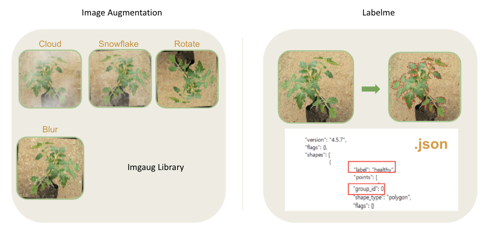
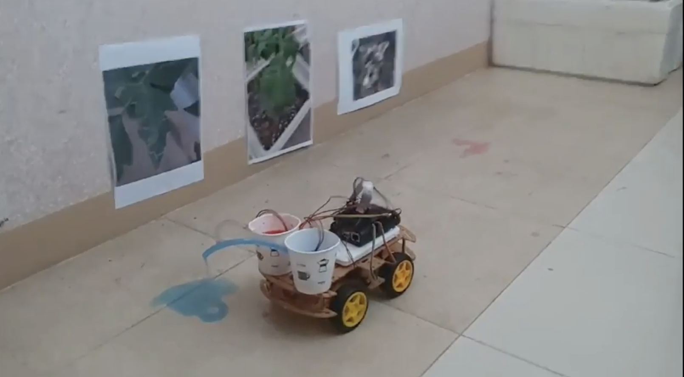

# 스마트팜

> 잡초 병충해 관리 시스템

## 프로젝트 설명

- 작물을 토마토로 선정했고, 건강한 토마토 작물 이미지와 병충해 이미지 수집
- 상이한 병충해 이미지 수를 image augmentation처리
- 선정된 YOLO 모델 학습 이미지를 위해 labelme 툴 이용해 annotation 진행
- 잡초와 병충해 모델링 작업
- 잡초와 병충해가 프린트 된 이미지를 rc카가 인식하고 잡초에는 파란색 물감을, 병충해에는 빨간색 물감을 분사
- 관리자 웹 페이지는 분류 결과 이미지, 분류 결과 클래스, 해당 병충해 방제법, 작물 정보로 구성

## 프로젝트 아키텍처

## 데이터 전처리 

* 수집한 데이터를 구름, 눈송이, 회전, 블러처리 등을 이용해 증강
* YOLO 모델에 학습시키기 위해 모든 데이터에 labelme 툴을 이용해 라벨링 작업을 진행하여 한 장에 하나의 json파일 생성

## 프로젝트 결과

*  AI 모델에서 나온 결과값에 따라 각각의 워터펌프를 제어해 살포
* 병충해 종류는 8가지이지만 프로토타입으로 설정하고 두 종류의 액체만 사용함
* 잡초에는 파란색물감, 병충해에는 빨간색 물감, 정상 작물은 지나감

## 발전 가능성

* GPS를 장착해 위치 인식하고 좌표 반환하여 이상 작물의 분포 파악과 추적 제거에 활용
* 강화학습을 적용해 자율주행 기술을 적용해 주행 자동화 
* 각종 센서를 장착해 온도, 습도 등의 시계열 데이터를 수집하고, 환경에 따른 병해 발생을 예측 

